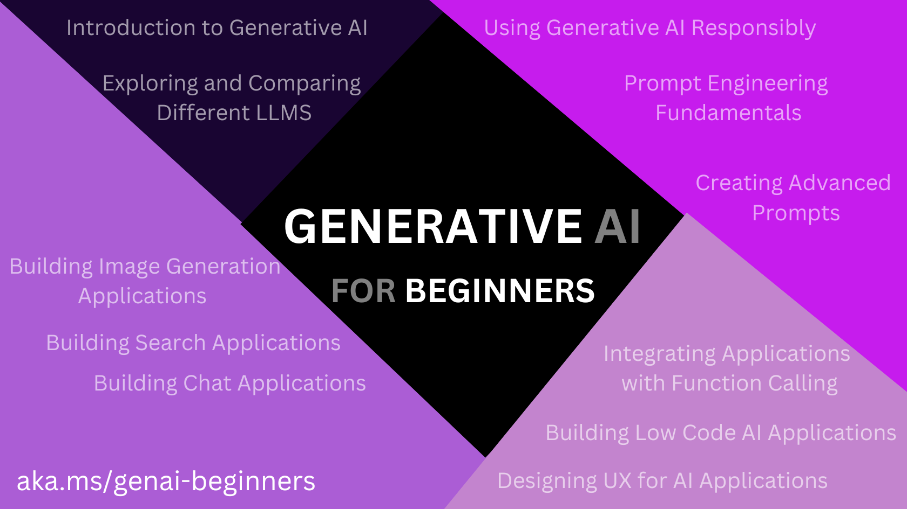
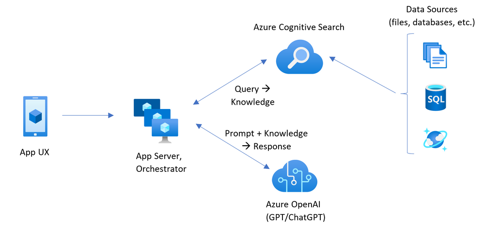

# Generative AI

Generative AI

## Usage

This sample requires either OpenAI endpoint or Azure OpenAI endpoint to run.


```bash
    # to run from the root of the solution
    dotnet run --project  dotnet/chatapp/ChatApp.csproj --name BasicDemo
     dotnet run --project  dotnet/chatapp/ChatApp.csproj --name DateTimeDemo
```

```bash
    export DOTNET_ROLL_FORWARD=LatestMajor
    export DOTNET_HOST_PATH=/home/kdcll/.dotnet/dotnet
```


## Assistants API

[Azure AI CLI](https://github.com/Azure/azure-ai-cli)

```bash
    dotnet tool install -g Azure.AI.CLI --prerelease

    # or local
    dotnet tool install Azure.AI.CLI --prerelease
```


Each request/ response between in the chat consumes tokens that (Azure) OpenAI charges and in addition models have context token limitations.

Context of the chat must contain only relevant information in form of Embeddings -> to specific storage of the text -> Embeddings

## References

### Generative AI

- [Repo for azure-openai-design-patterns](https://github.com/microsoft/azure-openai-design-patterns) - i.e. large label classifications with OpenAI.
- [Generative AI for Beginners - A Course](https://microsoft.github.io/generative-ai-for-beginners/#/) with the following [Github repo](https://github.com/Microsoft/generative-ai-for-beginners) 


- [Machine Learning for Beginners - A Curriculum](https://github.com/microsoft/ML-For-Beginners)

- [Intelligent app workshop - Miyagi](https://github.com/Azure/intelligent-app-workshop)


- [Introduction to Building AI Apps](https://github.com/Azure/intro-to-intelligent-apps) - This repository introduces and helps organizations get started with building Intelligent Apps and incorporating Large Language Models (LLMs) via AI Orchestration into them.


### Sematic Kernel / Memory

- [semantic kernel](https://github.com/microsoft/semantic-kernel)
- [semantic memory](https://github.com/microsoft/semantic-memory)
- [semantic kernel recipes](https://github.com/johnmaeda/SK-Recipes)
- [Semantic Kernel Starters](https://github.com/microsoft/semantic-kernel-starters)
- [Demystifying Retrieval Augmented Generation with .NET](https://devblogs.microsoft.com/dotnet/demystifying-retrieval-augmented-generation-with-dotnet/)

### Samples for RAG Chat

- [Chat with your data - Solution accelerator](https://github.com/Azure-Samples/chat-with-your-data-solution-accelerator) - A Solution Accelerator for the RAG pattern running in Azure, using Azure Cognitive Search for retrieval and Azure OpenAI large language models to power ChatGPT-style and Q&A experiences. This includes most common requirements and best practices.


- [ChatGPT + Enterprise data with Azure OpenAI and AI Search](https://github.com/Azure-Samples/azure-search-openai-demo) - A sample app for the Retrieval-Augmented Generation pattern running in Azure, using Azure AI Search for retrieval and Azure OpenAI large language models to power ChatGPT-style and Q&A experiences.


- [Azure Oenai RAG Workshop](https://github.com/Azure-Samples/azure-openai-rag-workshop) - Create your own ChatGPT with Retrieval-Augmented-Generation workshop


- [chat copilot app](https://github.com/microsoft/chat-copilot)
- [Qdrant Vector Database on Azure Cloud](https://github.com/Azure-Samples/qdrant-azure)
- [AKS Store (Vue) Demo with OpenAi (Sematic Kernel/Python)](https://github.com/Azure-Samples/aks-store-demo)
- [Sample Chat App with AOAI (Python/React)](https://github.com/microsoft/sample-app-aoai-chatGPT)
- 
- [Prompt flow is a suite of development tools](https://github.com/microsoft/promptflow)
- [huggingface transformers](https://github.com/huggingface/transformers)


### Articles

-[From zero to - nearly - hero with Azure OpenAI NLP and vector-based search in Azure Cognitive Search](https://techcommunity.microsoft.com/t5/azure-developer-community-blog/from-zero-to-nearly-hero-with-azure-openai-nlp-and-vector-based/ba-p/3936244) - the concepts and to exhibit a possible blueprint on using Azure OpenAI within your enterprise.


