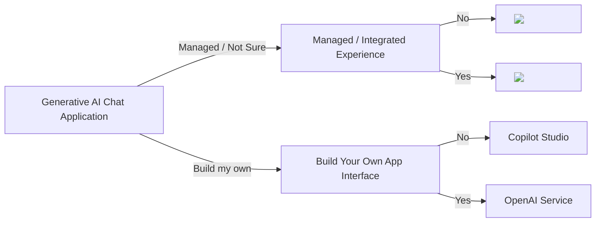
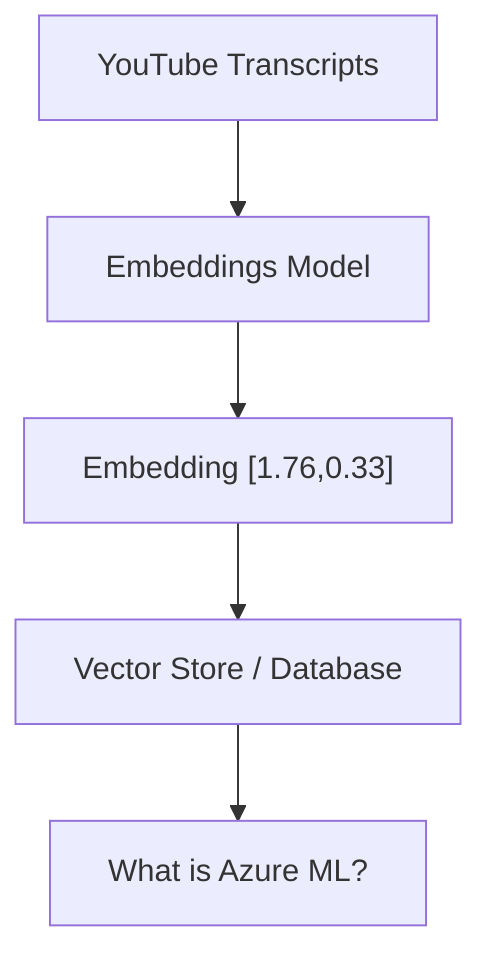

## Azure OpenAI Decision tree

I want a generative AI enabled chat application

## Understanding Embeddings

https://copilot.microsoft.com/
- Use OpenAI models and up-to-date web data to generate answers with transparent sources​
- Data travels outside tenant boundary but corporate data is protected from AI training​
- No additional cost for some M365 SKUs

Microsoft 365 Copilot
- Powered by the Microsoft Graph and integrated into M365 Apps (Word, Teams, etc.)
- Extensible with an ecosystem of plugins/connectors ​
- Easy toggle on the browser to use M365 Chat on the web or Bing Chat Enterprise

- Create chatbot experiences leveraging low code tools and Azure OpenAI Service out of the box.​
- Dynamically create chatbots grounded on a variety of data sources or webpages​
- Extend with connectors to additional applications

Azure AI Studio Preview https://ai.azure.com/

A collaboration between Microsoft and OpenAI that provides advanced language AI capabilities.

Azure OpenAI Studio https://oai.azure.com/
